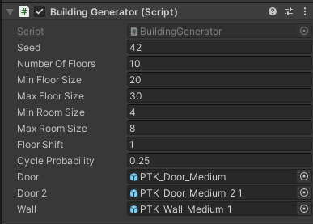
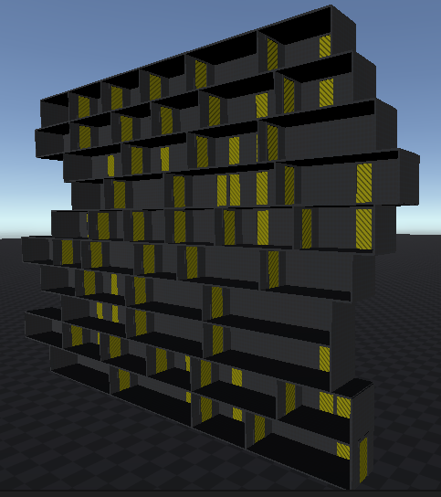
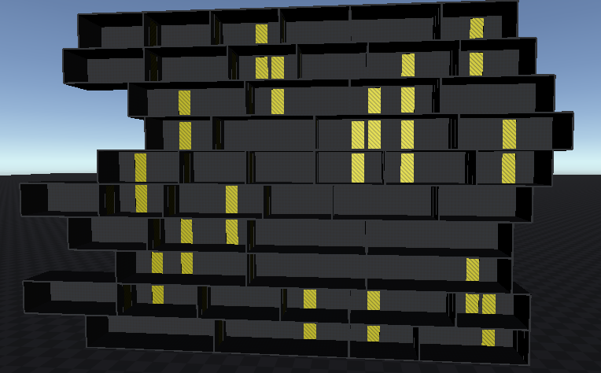
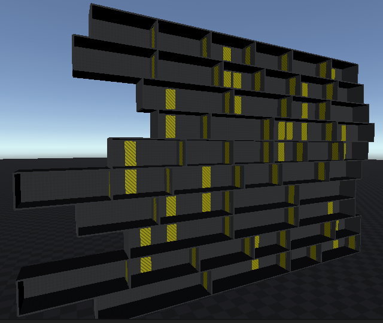

# Procedural Building Generation for the Game "Neighbours from Hell: Season 1"

The [Neighbours from Hell](https://en.wikipedia.org/wiki/Neighbours_from_Hell) is a puzzle strategy game that was released in 2003 
In this game, the gamer plays for Woody who participates in a reality show. The main goal of the show is to perform bad tricks upon Woody's neighbor and, this way, complicate his life. 
The game consists of several seasons. In this project, we focus on the first season where the game happens in a building with several floors and rooms where you should complete some tasks. 
The project attempts to create a generator of building with rooms and, especially, the doors distribution with the location logic specific exactly to this game.

More information is available in the project [report](./report/PCG__Portfolio_Project_2_Report.pdf).

# Method

The method is based on the usage of a modified depth-first search through a randomly generated graph of floors and rooms. The general pipeline of the proposed method is defined to be like this:
1. Generate floors and assign them random sizes concerning user-defined constraints.
2. Generate rooms on each floor and assign them random sizes concerning user-defined constraints and constraints of their floors.
3. Use a depth-first search to construct the paths through all rooms and create cycles in the graph with some probability.
4. Use prefabs of doors and a wall from a prototyping pack to generate a building according to the constructed graph.
5. Evaluate the results either manually or by automatic tests.

## Program Usage

### Prerequisites

You need to have the Unity3d engine installed.

### Run the application

Open the scene `/Asset/Scenes/project.unity` and press **Run** button.

### Change parameters

In case you want to change the default parameters of the building generation, 
click the Gameobject and you will see a bar with changeable settings:

  

## Examples

| Generated building from different views |
| :------------- |
|  |
|  |
|  |

## References

1. Unity Asset Store. Prototyping Pack. Accessed at https://assetstore.unity.com/packages/3d/prototyping-pack-free-94277.
